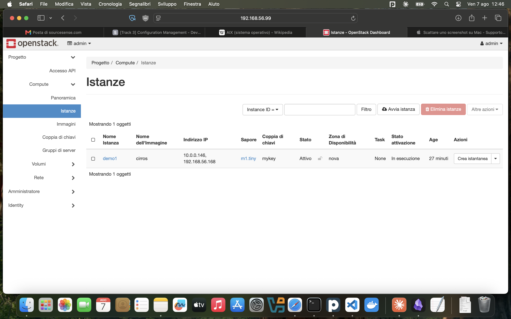

# Deploy di OpenStack con Kolla-Ansible (all-in-one)

Guida operativa a un deploy OpenStack "all-in-one" (tutto su una macchina) con
Kolla-Ansible, su una VM Ubuntu 24.04 creata con Vagrant/VirtualBox.
Ricostruisce l'intera procedura eseguita, con gli aggiustamenti rispetto alla
guida originale e le precauzioni imparate sul campo.

Risultato finale: un OpenStack completo (Keystone, Glance, Nova, Neutron,
Placement, Cinder, Horizon) che gira in container Docker, con un'istanza CirrOS
attiva e raggiungibile via SSH.



---

## Contesto dell'ambiente

- Host: MacBook con processore Intel, VirtualBox + Vagrant.
- Guest: Ubuntu 24.04 LTS.
- OpenStack: release 2025.1 (Epoxy), deployata con Kolla-Ansible.
- Nota sulla virtualizzazione: su VirtualBox+macOS la virtualizzazione annidata
  (nested) non risulta disponibile, quindi KVM non c'e'. Nova gira quindi in
  emulazione software (QEMU): funziona, ma le istanze sono piu' lente ad avviarsi.

Differenza rispetto a DevStack: Kolla-Ansible non e' uno strumento didattico ma
di deployment reale. Ogni servizio OpenStack gira in un container Docker, e
l'orchestrazione e' fatta con Ansible. Non si vedono processi systemd per i
singoli servizi, ma container.

---

## Precauzioni (le insidie da conoscere prima di iniziare)

Queste sono le cause dei blocchi incontrati. Conoscerle in anticipo fa
risparmiare ore.

1. opendev.org e Anubis. I `git clone` da `https://opendev.org/...` possono
   fallire con "is this a git repository?" perche' il sito ha un filtro anti-bot
   (Anubis) che serve una pagina HTML al posto del repository. Soluzione:
   clonare dal mirror ufficiale `https://github.com/openstack/...`. Vale sia per
   il clone iniziale di kolla-ansible, sia impostando `GIT_BASE` dove serve.

2. VPN aziendale e DNS. Con la VPN attiva sull'host, la VM puo' ereditare un DNS
   aziendale che dalla sua rete NAT non e' raggiungibile: la connettivita' di
   base funziona (ping a un IP passa) ma la risoluzione dei nomi no. Soluzione:
   forzare un DNS pubblico nella VM (8.8.8.8), reso permanente via provisioner.

3. Nessun KVM su VirtualBox+macOS. Anche abilitando `--nested-hw-virt on`,
   `/dev/kvm` non compare. Soluzione: usare QEMU (`nova_compute_virt_type: qemu`).

4. Stand-by dell'host. Se il portatile va in sospensione durante il deploy,
   VirtualBox mette in pausa la VM e le operazioni lunghe si spezzano a meta',
   lasciando stati incoerenti. Soluzione: disabilitare sospensione e spegnimento
   schermo, tenere il portatile a corrente. Lanciare i comandi lunghi in `tmux`.

5. Risoluzione dell'hostname per RabbitMQ. Il precheck di RabbitMQ pretende che
   l'hostname (`m1`) risolva a un unico IP, quello dell'interfaccia di gestione.
   Su Ubuntu il file `/etc/hosts` associa di default il nome anche a un indirizzo
   di loopback (127.0.x.x): va rimosso/commentato quel riferimento.

6. Secondo disco per Cinder. Il backend LVM di Cinder vuole un disco dedicato e
   vuoto (`/dev/sdb`), non spazio sul disco di sistema. Va aggiunto alla VM.

7. Terza interfaccia per Neutron. `neutron_external_interface` deve essere una
   scheda dedicata e senza IP. Con due sole interfacce (NAT + management) non ce
   n'e' una libera: va aggiunta una terza NIC "nuda".

8. Coerenza del branch. Il ramo del `git checkout` e `openstack_release` in
   `globals.yml` devono combaciare. Qui: entrambi `2025.1`.

---

## Prerequisiti

- RAM per la VM: almeno 10 GB (qui 12 GB, utile con QEMU).
- Disco di sistema: 40 GB. Piu' un secondo disco da 30 GB per Cinder.
- CPU: 4 vCPU.
- Host: sospensione disabilitata, alimentazione collegata.

---

## 1. La VM: Vagrantfile

Versione finale, con tutti gli accorgimenti: secondo disco per Cinder (creato in
modo idempotente), disattivazione del DNS-proxy di VirtualBox, terza interfaccia
senza IP per Neutron, e provisioner che fissa il DNS e attiva `eth2`.

```ruby
Vagrant.configure("2") do |config|
  config.vm.box = "bento/ubuntu-24.04"
  config.disksize.size = "40GB"

  config.vm.provider "virtualbox" do |vb|
    cinder_disk = File.join(File.dirname(__FILE__), "cinder.vdi")
    # crea il disco Cinder solo se non esiste gia' (idempotente)
    unless File.exist?(cinder_disk)
      vb.customize ["createmedium", "disk", "--filename", cinder_disk, "--size", 30720]
    end
    # attacca il disco a ogni avvio (sicuro da ripetere)
    vb.customize ["storageattach", :id, "--storagectl", "SATA Controller",
                  "--port", 1, "--device", 0, "--type", "hdd", "--medium", cinder_disk]
    # scollega la VM dal DNS dell'host (evita l'interferenza della VPN)
    vb.customize ["modifyvm", :id, "--natdnshostresolver1", "off"]
    vb.customize ["modifyvm", :id, "--natdnsproxy1", "off"]
    vb.memory = "12288"
    vb.cpus = 4
  end

  config.vm.define "m1" do |m1|
    m1.vm.hostname = "m1"
    # eth1: rete di management, vista dall'host
    m1.vm.network "private_network", ip: "192.168.56.10"
    # eth2: interfaccia nuda dedicata a Neutron (nessun IP)
    m1.vm.network "private_network", type: "dhcp", auto_config: false
  end

  # provisioner: DNS fisso + attivazione di eth2 (rieseguibile con vagrant provision)
  config.vm.provision "shell", inline: <<-SHELL
    cat > /etc/netplan/99-dns.yaml <<EOF
network:
  version: 2
  ethernets:
    eth0:
      nameservers:
        addresses: [8.8.8.8, 1.1.1.1]
EOF
    chmod 600 /etc/netplan/99-dns.yaml
    netplan apply
    ip link set eth2 up
  SHELL
end
```

Note e trappole viste:

- Il percorso del disco (`--filename`) e' un file sull'host (il `.vdi`), NON
  `/dev/sdb`. Dentro la VM il disco appare come `/dev/sdb` in automatico.
- Il disco del box `bento/ubuntu-24.04` e' gia' ~64 GB: il plugin `disksize`
  puo' solo ingrandire, quindi un valore inferiore genera l'errore
  `Disk cannot be decreased`. In quel caso togliere la riga o alzarne il valore.
- La terza `private_network` richiede `type: "dhcp"` per non dare l'errore
  `address family must be specified`, ma resta nuda grazie a `auto_config: false`.
- `ip link set eth2 up` a runtime non e' persistente al reboot: il provisioner
  la riaccende a ogni `vagrant reload --provision`.

Comando per applicare tutto:

```bash
vagrant reload --provision
```

Verifiche dentro la VM (`vagrant ssh`):

```bash
ip -br addr          # eth0 (NAT), eth1 (192.168.56.10), eth2 (UP, senza IP)
ping -c 3 github.com # la risoluzione dei nomi funziona
lsblk                # presenza di sdb da 30 GB, vuoto
```

---

## 2. Preparazione del sistema

Da eseguire nella VM. I passi di sistema valgono per ogni utente, quindi si
possono fare come `vagrant`.

```bash
sudo apt update && sudo apt upgrade -y
sudo apt install -y python3-dev libffi-dev gcc libssl-dev python3-venv python3-pip \
    libdbus-1-dev libglib2.0-dev pkg-config git lvm2
```

Preparazione del disco per Cinder (LVM sul disco dedicato `/dev/sdb`):

```bash
sudo pvcreate /dev/sdb
sudo vgcreate cinder-volumes /dev/sdb
sudo vgs                      # deve elencare "cinder-volumes"
```

`pvcreate` mette il disco a disposizione di LVM; `vgcreate cinder-volumes` crea
il volume group da cui Cinder ritagliera' i volumi. Il nome `cinder-volumes` deve
coincidere con quello indicato in `globals.yml`.

---

## 3. Utente kolla e cartella /etc/kolla

```bash
sudo adduser kolla            # password a scelta
sudo usermod -aG sudo kolla
sudo mkdir -p /etc/kolla
sudo chown -R kolla:kolla /etc/kolla
```

Precauzione importante: se durante i tentativi si sono copiati file in
`/etc/kolla` con `sudo`, quei file restano di proprieta' di root e bloccano i
comandi lanciati come `kolla`. Il `chown -R kolla:kolla /etc/kolla` (ricorsivo)
rimette tutto coerente.

Da qui in avanti, lavorare SEMPRE come utente `kolla` (tranne i comandi che
richiedono esplicitamente `sudo`):

```bash
su - kolla
```

---

## 4. Ambiente virtuale e Kolla-Ansible

Da eseguire come `kolla`, cosi' l'ambiente virtuale nasce nella sua home ed e'
coerente per tutti i comandi successivi.

```bash
python3 -m venv ~/kolla-venv
source ~/kolla-venv/bin/activate

pip install -U pip
pip install "ansible-core==2.15.*"
pip install docker dbus-python

# clone dal mirror GitHub (NON opendev, per via di Anubis)
git clone https://github.com/openstack/kolla-ansible
cd kolla-ansible
git checkout stable/2025.1        # branch allineato a openstack_release
pip install .

pip install python-openstackclient
```

Precauzione: se l'ambiente virtuale era stato creato come utente diverso, va
ricreato come `kolla`. L'ambiente virtuale e' legato alla sessione e all'utente:
cambiando utente va riattivato, e se sta nella home sbagliata non e' raggiungibile.

---

## 5. Configurazione

```bash
sudo mkdir -p /etc/kolla        # se non gia' fatto
# copia dei file di esempio (poi assicurarsi che siano di kolla, vedi passo 3)
cp -r ~/kolla-venv/share/kolla-ansible/etc_examples/kolla/* /etc/kolla/
cp ~/kolla-venv/share/kolla-ansible/ansible/inventory/all-in-one .

kolla-genpwd                    # genera /etc/kolla/passwords.yml
```

La password di admin per Horizon si trova poi con:

```bash
grep keystone_admin_password /etc/kolla/passwords.yml
```

### Inventory all-in-one

Il file `all-in-one` NON va modificato: e' gia' configurato per il single-node.
Tutti i gruppi puntano a `localhost` con `ansible_connection=local`, e la catena
di `[servizio:children]` fa cadere ogni servizio su `localhost`. La nota della
guida ("modificare per single-node") e' fuorviante: e' gia' cosi'.

### globals.yml (versione finale)

```yaml
---
kolla_base_distro: "ubuntu"
openstack_release: "2025.1"                       # allineato al checkout
kolla_internal_vip_address: "192.168.56.99"       # IP LIBERO nella rete di eth1
network_interface: "eth1"                          # interfaccia di management
neutron_external_interface: "eth2"                 # scheda nuda per Neutron
neutron_plugin_agent: "openvswitch"
enable_cinder: "yes"
enable_cinder_backend_lvm: "yes"
cinder_volume_group: "cinder-volumes"
enable_centralized_logging: "no"
enable_grafana: "no"
enable_prometheus: "no"
enable_heat: "no"
enable_horizon: "yes"
docker_client_timeout: 120
ansible_python_interpreter: /home/kolla/kolla-venv/bin/python
nova_compute_virt_type: "qemu"                     # niente KVM: emulazione
```

Aggiustamenti rispetto alla guida originale:

- `openstack_release`: da `2025.2` a `2025.1` (coerenza col branch).
- `kolla_internal_vip_address`: un IP libero nella rete di management
  (`192.168.56.99`), diverso dall'IP della VM (`.10`).
- `network_interface`: `eth1` (nomi reali della VM, non `ens18`).
- `neutron_external_interface`: `eth2` (nomi reali, non `ens19`).
- `nova_compute_virt_type: qemu`: gia' presente nella guida, provvidenziale
  perche' non c'e' KVM.

---

## 6. Deploy

Tutti come `kolla`, con il venv attivo, dalla cartella `~/kolla-ansible`.
Consigliato lanciarli in `tmux`.

```bash
kolla-ansible install-deps
kolla-ansible bootstrap-servers -i ./all-in-one
kolla-ansible prechecks -i all-in-one
kolla-ansible deploy -i all-in-one
kolla-ansible post-deploy -i all-in-one
```

Cosa fanno: `install-deps` scarica le collection Ansible; `bootstrap-servers`
installa Docker e prepara il sistema; `prechecks` verifica l'idoneita'
dell'ambiente PRIMA di installare; `deploy` scarica e avvia tutti i container;
`post-deploy` genera `/etc/kolla/admin-openrc.sh`.

Precauzioni durante il deploy:

- `install-deps`: un errore SSL transitorio (connessione troncata, tipico con
  VPN) puo' comparire; Ansible ritenta. Verificare la completezza con
  `ansible-galaxy collection list` (devono esserci ansible.posix, ansible.utils,
  community.general, community.docker, openstack.kolla).
- prechecks: se fallisce su RabbitMQ con "Hostname has to resolve uniquely",
  correggere `/etc/hosts` togliendo/commentando la riga che lega l'hostname a un
  IP di loopback (127.0.x.x), lasciando solo `192.168.56.10 m1`. Verificare con
  `getent ahostsv4 m1` (deve restituire solo 192.168.56.10), poi rilanciare i
  prechecks. Nota: `/etc/hosts` puo' essere rigenerato ai reload; per renderla
  stabile, spostare la correzione nel provisioner.
- I prechecks si fermano al primo errore bloccante: si procede a ondate, si
  corregge e si rilancia finche' non passano tutti.

Verifica del deploy:

```bash
source /etc/kolla/admin-openrc.sh
openstack endpoint list
```

Devono comparire gli endpoint di keystone, glance, nova, neutron, cinder,
placement, tutti sul VIP `192.168.56.99`.

---

## 7. Verifica e primo utilizzo

### Preparazione ambiente demo (immagine, flavor, reti)

Lo script `init-runonce` crea immagine CirrOS, flavor, reti, router e chiave SSH.
I valori di rete predefiniti non vanno bene: si passano come variabili
d'ambiente. Qui la rete esterna e' messa sulla rete `192.168.56.x` (quella vista
dall'host), per poter raggiungere le VM dal Mac. Range dei floating IP fuori dagli
indirizzi gia' usati (.10 la VM, .99 il VIP).

```bash
EXT_NET_CIDR='192.168.56.0/24' \
EXT_NET_RANGE='start=192.168.56.150,end=192.168.56.199' \
EXT_NET_GATEWAY='192.168.56.1' \
~/kolla-ansible/tools/init-runonce
```

Nota sul trade-off: rete esterna sulla private = VM raggiungibili dal Mac ma
senza uscita internet; rete esterna sulla NAT (10.0.2.x, gateway 10.0.2.2) =
uscita internet ma non raggiungibili dal Mac. Non si possono avere entrambe con
una sola rete esterna.

### Prima istanza

```bash
openstack server create \
    --image cirros \
    --flavor m1.tiny \
    --key-name mykey \
    --network demo-net \
    demo1

openstack server list        # attendere ACTIVE (lento con QEMU)
```

Usare `m1.tiny`: sotto QEMU un flavor grande sarebbe lentissimo.

### Floating IP e accesso

```bash
openstack floating ip create public1
openstack server add floating ip demo1 <floating-ip>
openstack server list        # due indirizzi: 10.0.0.x e 192.168.56.15x
```

Verifica delle regole del security group (il nome `default` esiste per ogni
progetto, quindi puo' essere ambiguo: usare l'ID del gruppo del progetto giusto):

```bash
openstack security group list
openstack security group rule list <ID-del-gruppo-default-del-progetto>
```

Devono esserci ingress per tcp/22 (SSH) e icmp (ping); init-runonce le crea.

### SSH nell'istanza

La chiave privata `mykey` viene generata da init-runonce nella home dell'utente
(es. `~/.ssh/id_ecdsa`).

Dalla VM host:

```bash
ssh cirros@192.168.56.168
```

Dal Mac: copiare la chiave privata nella cartella condivisa `/vagrant` (che
corrisponde alla cartella del progetto sull'host), poi:

```bash
chmod 600 id_ecdsa
ssh -i id_ecdsa cirros@192.168.56.168
```

Dentro CirrOS: l'utente e' `cirros`; `lsblk` mostra `vda` (disco effimero del
flavor, muore con l'istanza). L'istanza non "vede" il floating IP: quello vive
sul router di Neutron, che fa NAT verso l'IP interno.

### Dashboard

Horizon e' raggiungibile dal browser dell'host su `http://192.168.56.99`
(utente `admin`, password da `passwords.yml`).

---

## Stato e prossimi passi

Completato: deploy Kolla-Ansible all-in-one, istanza CirrOS attiva, floating IP,
accesso SSH dall'host, dashboard raggiungibile.

Da fare (Cinder, rimandato): creare un volume persistente sul volume group
`cinder-volumes`, attaccarlo a `demo1` e verificarlo come secondo disco (`vdb`)
dentro l'istanza. E' la dimostrazione pratica della differenza tra disco
effimero (dal flavor, muore con la VM) e volume persistente (sopravvive).

---

## Appendice: guida originale, con annotazioni

Sintesi della procedura di partenza e delle modifiche applicate.

- Requisiti: RAM 10 GB minimo (usati 12), disco di boot 40 GB + disco Cinder 30
  GB, Ubuntu 24.04. -> Aggiunto il secondo disco nel Vagrantfile.
- Aggiornamento e dipendenze di sistema. -> Invariato.
- Preparazione disco Cinder: `pvcreate /dev/sdb`, `vgcreate cinder-volumes`. ->
  Il disco `/dev/sdb` va creato nella VM (secondo disco Vagrant).
- Ambiente virtuale e installazione: venv, ansible-core 2.15, docker, dbus.
  Clone di kolla-ansible + `checkout stable/2025.2`. -> Clone da GitHub (non
  opendev), checkout `stable/2025.1`.
- Utente kolla, cartelle, copia file, `kolla-genpwd`. -> Aggiunto `chown -R`
  ricorsivo su `/etc/kolla`; lavorare sempre come `kolla`.
- globals.yml. -> `openstack_release: 2025.1`; interfacce `eth1`/`eth2`; VIP
  `192.168.56.99`; `nova_compute_virt_type: qemu` (gia' presente).
- Inventory all-in-one. -> Nessuna modifica necessaria (gia' single-node).
- install-deps, bootstrap-servers, prechecks, deploy, post-deploy. -> Ai
  prechecks, correzione `/etc/hosts` per RabbitMQ.
- init-runonce e creazione istanza. -> Variabili `EXT_NET_*` adattate alla rete
  `192.168.56.x`.
